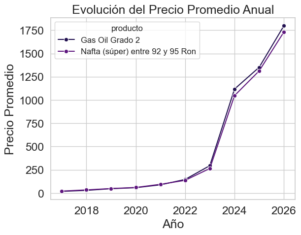
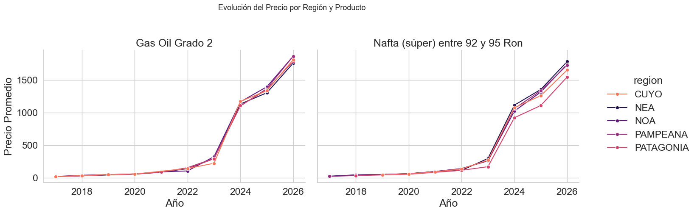
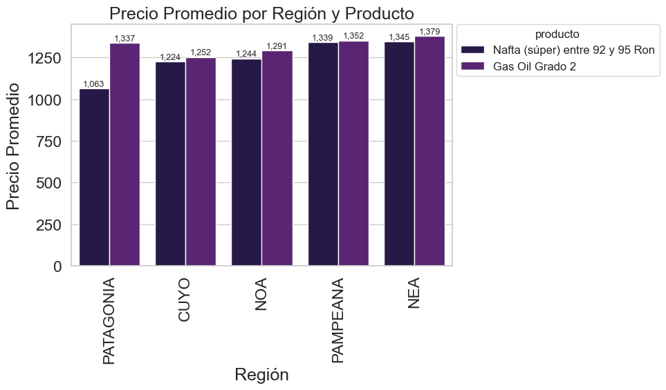
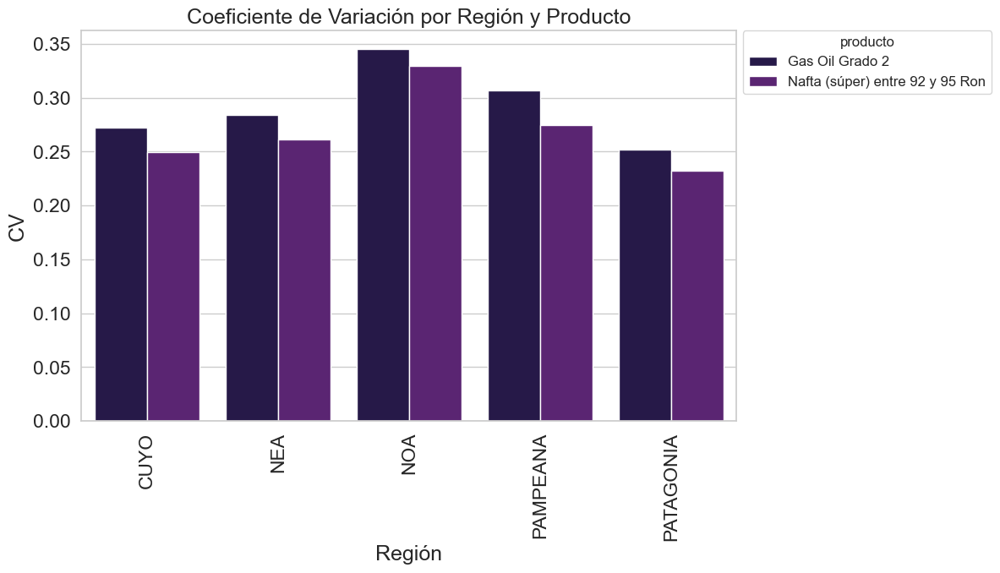
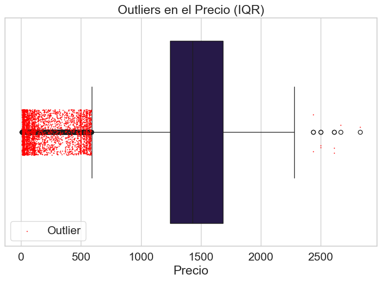
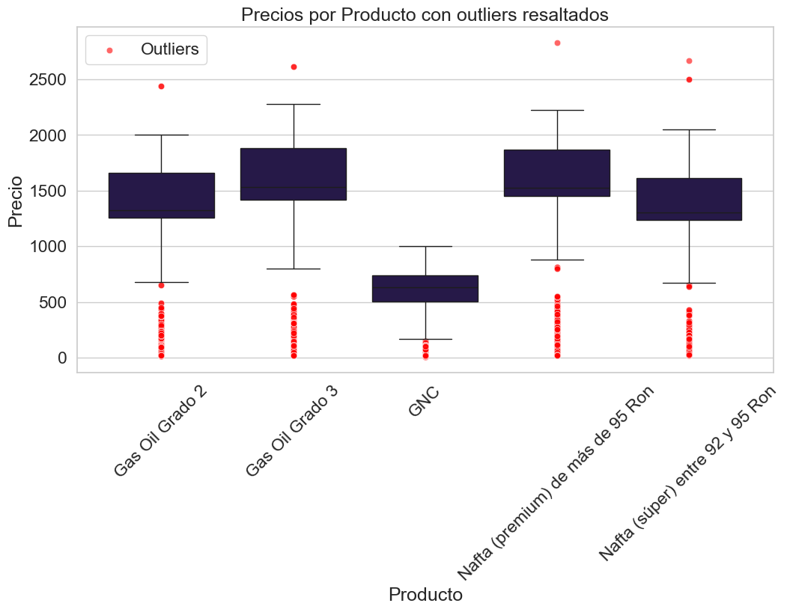
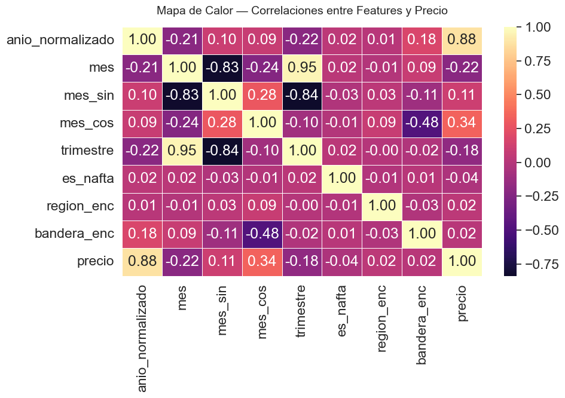
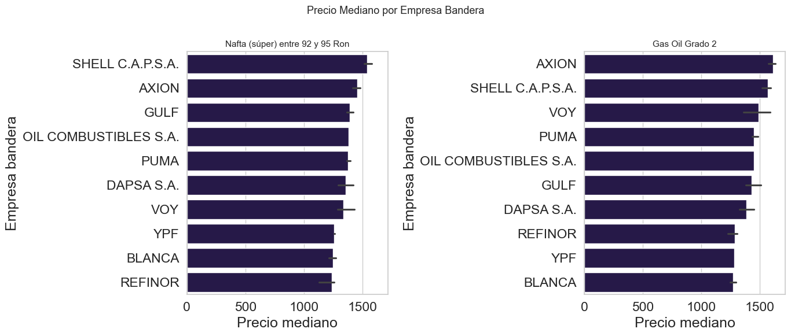
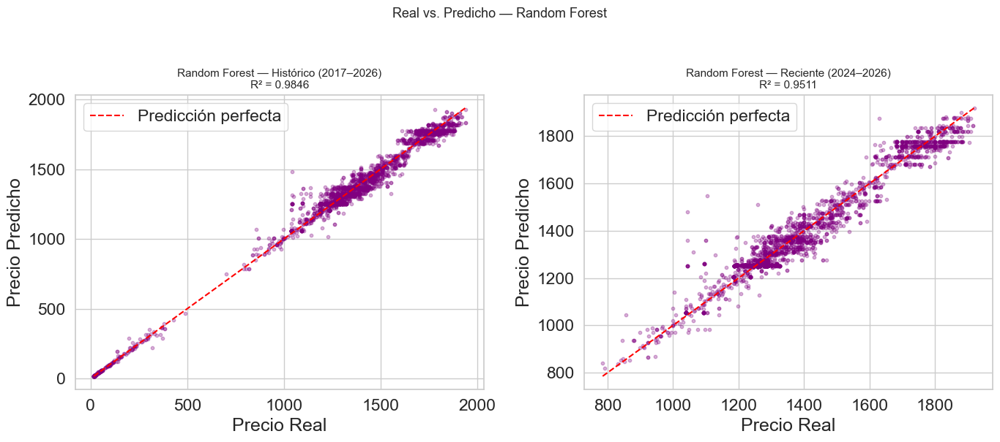
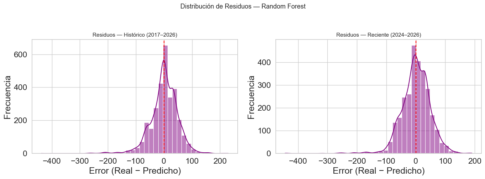

# ⛽ Análisis y Predicción de Precios de Combustibles en Argentina

Proyecto de ciencia de datos sobre la evolución de precios de combustibles en Argentina utilizando datos públicos oficiales.

El análisis explora:
- tendencias históricas,
- diferencias regionales,
- comportamiento por tipo de combustible,
- y modelos predictivos de precios.

📂 Dataset: datos.gob.ar — Resolución 314/2016

---

## 📊 Dataset

- 36.823 registros
- 3.494 empresas
- 1.066 localidades
- Período analizado: 2017–2024

---

## 📌 Principales hallazgos

### 🔄 Cambio estructural en 2022

El Gas Oil pasó de ser históricamente más barato que la Nafta a superar su precio promedio, mostrando una tendencia creciente estadísticamente significativa.

### 🗺️ Diferencias regionales

Se detectaron diferencias sistemáticas entre regiones:
- NEA y región Pampeana presentan precios consistentemente más altos.
- El comportamiento territorial se mantiene incluso controlando por outliers.

### 📈 Tendencia temporal

La Nafta presenta una tasa de crecimiento anual superior al Gas Oil.

---

## 🤖 Modelado predictivo

Se entrenaron distintos modelos de machine learning para estimar el precio por litro utilizando variables:
- temporales,
- geográficas,
- comerciales,
- y categóricas.

### 📊 Resultados

| Modelo | R² | MAPE |
|---|---|---|
| Random Forest | 0.98 | 2.8% |
| Gradient Boosting | 0.98 | 5.5% |
| Ridge Regression | 0.85 | ~67% |

### 🏆 Mejor modelo

Random Forest obtuvo el mejor desempeño, evidenciando relaciones no lineales entre:
- región,
- tiempo,
- empresa,
- y tipo de combustible.

---

## 📸 Visualizaciones

### 📈 Evolución temporal

<table>
  <tr>
    <td align="center">
      
       
    </td>
    <td align="center">
      
       
    </td>
  </tr>
</table>

---

### 🗺️ Diferencias regionales

<table>
  <tr>
    <td align="center">
      
       
    </td>
    <td align="center">
      
       
    </td>
  </tr>
</table>

---

### 📊 Distribución de precios

<table>
  <tr>
    <td align="center">
      
       
    </td>
    <td align="center">
      
       
    </td>
  </tr>
</table>

---

### 🌲 Importancia de variables

<table>
  <tr>
    <td align="center">
      
       
    </td>
    <td align="center">
      
       
    </td>
  </tr>
</table>

---

### 🤖 Predicciones vs valores reales

<table>
  <tr>
    <td align="center">
      
       
    </td>
    <td align="center">
      
       
    </td>
  </tr>
</table>

---

## 🛠️ Stack

